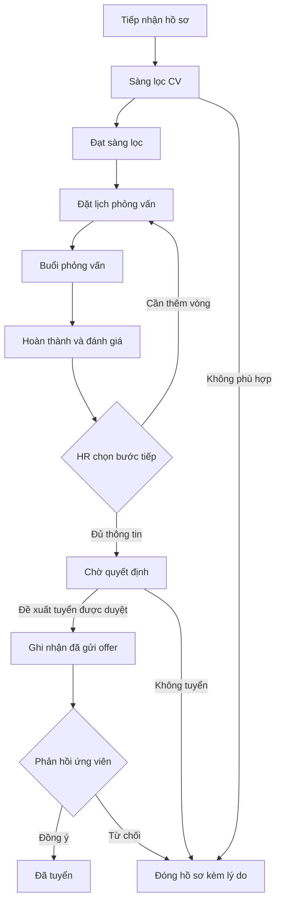

# Kế hoạch chỉnh flow HireFlow cho HR

Ngày rà soát: 06/09/2026. Trạng thái: đợt 1–3 đã triển khai (Room v6 + migration Supabase mới); đợt 4 kiểm chứng tay chưa làm.

## 1. Kết luận và phạm vi

HireFlow đã có trình tự tuyển dụng và kiểm tra điều kiện trong `RecruitmentRules`. Điểm gây rối chính là HR phải tự nối các màn hình, tự hiểu điều kiện bị chặn và tự tìm lại ứng viên sau mỗi bước. Một số quan hệ dữ liệu cũng chưa đủ để hỗ trợ nhiều vòng phỏng vấn một cách nhất quán.

Mục tiêu: từ một hồ sơ, HR biết ứng viên đang ở đâu, còn thiếu gì và có một hành động chính để tiếp tục. Trang Hôm nay đưa HR đến đúng hồ sơ hoặc buổi phỏng vấn cần xử lý.

Phạm vi đề xuất là tuyển dụng nội bộ trong workspace hiện có. Giữ nền tảng Room, Supabase, đồng bộ offline và Blind Review. Chưa mở rộng thành quản trị nhân sự, tuyển dụng công khai, gửi email thật, OCR hay hệ thống chiến dịch tuyển dụng. Trước mắt một hồ sơ vẫn đại diện cho một ứng viên ứng tuyển một vị trí; hỗ trợ một người ứng tuyển nhiều vị trí cần thiết kế riêng sau này.

## 2. Bằng chứng hiện trạng

Đã đọc navigation, toàn bộ màn hình nghiệp vụ chính, ViewModel, repository, entities, recruitment rules, các test rules hiện có và schema Supabase liên quan. Đã mở demo trên `emulator-5554`, quan sát Dashboard, Pipeline, chọn ứng viên và mở hồ sơ bằng screenshot/UI hierarchy. Đây là bản APK đang cài; chưa build lại để xác nhận APK trùng hoàn toàn với checkout. Các nhận định về code bên dưới dựa trên checkout hiện tại. Chưa kiểm thử ghi dữ liệu tuyển dụng hoặc đồng bộ cloud trong lần rà soát này.

| Ưu tiên | Vấn đề đã thấy | Hệ quả với HR | Vị trí code |
|---|---|---|---|
| P0 | Hồ sơ không có callback/nút đặt lịch; thao tác chuyển vòng, chấm điểm nằm cuối trang sau thông tin và CV | Đang xử lý một người nhưng phải quay ra tab Lịch và chọn lại | `CandidateDetailScreen.kt:84–97,254–275`; `HireFlowApp.kt` |
| P0 | Ba ô Chờ đánh giá, Đang sàng lọc, Chờ phản hồi offer cùng mở danh sách ứng viên không truyền bộ lọc | Con số không dẫn tới đúng công việc tương ứng | `DashboardScreen.kt:85–95`; `HireFlowApp.kt` |
| P0 | Công việc hôm nay lấy từ `hr_tasks`, bấm chỉ đổi `completed`; bảng task không có liên kết ứng viên/buổi phỏng vấn | Tick task không hoàn thành nghiệp vụ. Demo đang hiển thị 2 người sàng lọc nhưng báo không có công việc | `DashboardScreen.kt:85,136–142`; `Models.kt`; `HireFlowRepository.kt:122–124` |
| P0 | Scorecard chỉ liên kết ứng viên; repository lưu theo cặp ứng viên/người đánh giá | Chấm vòng mới có thể cập nhật phiếu cũ, không phân biệt kết quả từng buổi | `Models.kt:ScorecardEntity`; `HireFlowRepository.kt:105–119`; `HireFlowDao.kt:scorecardForEvaluator` |
| P0 | Khi route scorecard có ID không nằm trong tập được hiển thị, màn hình chọn ứng viên đầu tiên khác | Có thể mở đánh giá không đúng người từ một liên kết cụ thể | `ScorecardScreen.kt:availableCandidates,selectedId` |
| P0 | Chi tiết kiểm tra chuyển vòng bằng phiếu của người đăng nhập; Pipeline/repository dùng toàn bộ phiếu ứng viên | Khi có nhiều người đánh giá, hai màn hình có thể cho phép/chặn khác nhau | `HireFlowApp.kt:candidate/{id}`; `CandidateDetailScreen.kt:112`; `HireFlowRepository.kt:35–39` |
| P1 | Lịch được chọn nhưng phần chi tiết nằm sau toàn bộ danh sách | Danh sách dài khiến kết quả thao tác chọn khó nhận ra | `InterviewsScreen.kt:127–173` |
| P1 | Dialog lịch tự chọn ứng viên đầu tiên, mặc định ngày mai; lưu xong đóng nhưng không chuyển đến lịch vừa tạo | HR dễ không thấy lịch mình vừa lưu ở tab Hôm nay | `InterviewsScreen.kt:178–190,249–256` |
| P1 | Form tạo ứng viên bắt buộc kinh nghiệm và kỹ năng từ danh sách cố định, chưa có CV ngay trong form | Tiếp nhận nhanh một CV phải nhập nhiều thông tin chưa chắc đã biết | `CandidatesScreen.kt:243–266` |
| P1 | UI thông báo lưu scorecard/đính kèm CV thành công ngay sau khi gọi hàm bất đồng bộ | Có thể báo thành công dù lưu thất bại; dialog đóng sớm có thể mất bản nhập | `ScorecardScreen.kt:onSave`; `CandidateDetailScreen.kt:114–118`; `HireFlowViewModel.kt` |
| P1 | Offer → Hired không có điều kiện phản hồi; từ chối đổi trạng thái ngay, không ghi lý do | Không phân biệt HR đề xuất tuyển, ứng viên nhận offer và ứng viên đồng ý | `RecruitmentRules.kt:advanceBlockReason`; `CandidateDetailScreen.kt:275` |
| P1 | Interview chỉ có boolean completed; lịch chưa xong của hồ sơ kết thúc bị ẩn | Thiếu đổi lịch/hủy/vắng mặt; việc ẩn không giải phóng lịch trong dữ liệu kiểm tra trùng của repository | `Models.kt:InterviewEntity`; `RecruitmentRules.kt:shouldShowInterview,scheduleBlockReason`; `HireFlowRepository.kt:70–79` |
| P2 | Năm tab dưới, menu đầu trang lặp lại các điểm đến, Pipeline là lưới hai cột chọn trước rồi thao tác ở chân trang | Nhiều cách điều hướng và cách chạm khác nhau cho cùng một hồ sơ | `HireFlowApp.kt:bottomDestinations`; `Common.kt:ScreenHeader`; `PipelineScreen.kt` |

## 3. Cấu trúc màn hình đề xuất

Thanh dưới chỉ gồm **Hôm nay · Ứng viên · Lịch**. Tài khoản/cài đặt nằm ở avatar.

| Màn hình | Vai trò | Tương tác chính |
|---|---|---|
| Hôm nay | Danh sách việc cần xử lý | Bấm việc → đúng hồ sơ, lịch hoặc phiếu đánh giá; bấm chỉ số → danh sách đã lọc |
| Ứng viên | Tra cứu và theo dõi tiến độ | Tìm kiếm, lọc vị trí/giai đoạn/việc cần làm; chuyển chế độ Danh sách hoặc Theo giai đoạn |
| Hồ sơ ứng viên | Xử lý xuyên suốt một hồ sơ | Tóm tắt trạng thái + việc tiếp theo, CV, lịch, đánh giá, lịch sử |
| Lịch | Theo dõi lịch của nhiều ứng viên | Bấm một lịch → trang chi tiết riêng; thêm lịch bằng nút luôn dễ thấy |
| Chi tiết phỏng vấn | Xử lý một buổi cụ thể | Xem hồ sơ/CV, đổi lịch, hủy, hoàn thành, đánh giá đúng buổi |
| Phiếu đánh giá | Đánh giá đúng ứng viên và buổi phỏng vấn | Chấm điểm, lưu, trở lại đúng nơi mở; không có dropdown đổi người trong form |

Pipeline trở thành chế độ xem trong Ứng viên. Trên điện thoại ưu tiên chip giai đoạn kèm số lượng và danh sách rộng toàn màn hình; chạm card luôn mở hồ sơ. Tab Đánh giá độc lập được thay bằng nhóm Cần đánh giá trên Hôm nay và mục Đánh giá trong từng hồ sơ.

Các màn hình gốc không có nút Back về Dashboard. Màn hình con quay lại đúng nơi mở, giữ bộ lọc, vị trí cuộn và ngày lịch. Không điều hướng ngầm sang một ứng viên khác nếu ID đích không hợp lệ.

## 4. Flow nghiệp vụ mục tiêu

Mọi giai đoạn đang hoạt động đều có hành động Đóng hồ sơ, phân biệt HR loại, ứng viên rút và ứng viên từ chối offer bằng lý do. Giữ lịch sử khi đóng. Không đưa xóa vĩnh viễn thành bước mặc định của quy trình.

Giữ các enum giai đoạn hiện có ở đợt đầu để giảm migration. Đổi nhãn UI APPLIED thành Mới tiếp nhận, OFFER thành Chờ phản hồi offer khi đã ghi nhận gửi. Các nhãn Chưa đặt lịch, Chờ đánh giá là việc cần làm suy ra từ dữ liệu, không tạo thêm hàng loạt giai đoạn.

| Tình huống | Hành động chính nhìn thấy ngay | Kết quả |
|---|---|---|
| Mới tiếp nhận, thiếu CV | Bổ sung CV | Lưu CV, sau đó gợi ý xem/sàng lọc |
| Mới tiếp nhận, có CV | Bắt đầu sàng lọc | Sang Sàng lọc và mở CV |
| Sàng lọc | Đạt sàng lọc | Sang Phỏng vấn; hiện Đặt lịch ngay trên hồ sơ |
| Đã đạt sàng lọc, chưa có lịch | Đặt lịch phỏng vấn | Mở form có sẵn ứng viên; bỏ form vẫn thể hiện rõ Chưa đặt lịch |
| Có lịch tương lai | Xem lịch phỏng vấn | Mở đúng buổi; Đổi lịch là hành động phụ |
| Buổi đã diễn ra, chưa hoàn thành | Hoàn thành & đánh giá | Lưu completed thành công rồi mở phiếu đúng buổi |
| Đã hoàn thành, thiếu phiếu | Viết đánh giá | Không cần chọn lại người hoặc buổi |
| Đã lưu phiếu | Xem tổng hợp đánh giá | HR chọn Phỏng vấn thêm hoặc Chốt phỏng vấn |
| Chờ quyết định | Ra quyết định | Xem kết quả các vòng, chọn đề xuất offer hoặc đóng hồ sơ |
| Chờ phản hồi offer | Ghi nhận phản hồi | Đồng ý → Đã tuyển; từ chối → Đóng hồ sơ với lý do |
| Hồ sơ kết thúc | Xem kết quả | Xem lại CV, lịch và đánh giá ở chế độ đọc |

Quy tắc cụ thể:

- Giữ điều kiện có CV trước khi đạt sàng lọc ở MVP này; khi thiếu, nút Bổ sung CV phải thao tác được ngay.
- Hoàn thành buổi không tự đồng nghĩa kết thúc toàn bộ vòng phỏng vấn. HR chọn rõ Phỏng vấn thêm hoặc Chốt phỏng vấn sau khi xem đánh giá.
- Chốt phỏng vấn chỉ khi các buổi còn hiệu lực đã hoàn thành và có đánh giá cần thiết; buổi hủy/vắng mặt phải được xử lý trước. Phiếu của buổi trước không thay phiếu của buổi mới.
- MVP theo một người đánh giá chính cho mỗi buổi. Nếu triển khai nhiều người đánh giá/buổi, cần danh sách phân công và quy tắc đủ phiếu riêng.
- Trong đợt sửa nhanh, giữ gate Hire/Strong Hire hiện tại nhưng dùng một tập phiếu thống nhất trên mọi màn hình. Trong đợt nghiệp vụ đầy đủ, HR chốt quyết định riêng dựa trên tổng hợp; các ý kiến trái chiều được hiển thị rõ, không suy ra quyết định chỉ từ một phiếu tích cực bất kỳ.
- Consider hiển thị Cần cân nhắc và đường đi Phỏng vấn thêm; cho phép quay từ Chờ quyết định về Phỏng vấn bằng sự kiện có lịch sử.
- Ghi nhận đã gửi offer chỉ là nhập lại hành động HR đã thực hiện bên ngoài. App không giả lập việc đã gửi email.
- Đã tuyển trong MVP được định nghĩa là ứng viên đồng ý offer, chưa đại diện cho đã đi làm. Hiển thị lời giải thích khi ghi nhận phản hồi.
- Hoàn thành lịch rồi hoàn tác phải xét phiếu và giai đoạn liên quan; không cho đưa hồ sơ về trạng thái mâu thuẫn bằng toggle trực tiếp.

## 5. Bố cục để HR dễ thao tác

Hồ sơ ứng viên ưu tiên thứ tự: **Tên/vị trí → Giai đoạn và việc tiếp theo → CV → Lịch và đánh giá → Thông tin bổ sung → Lịch sử**. Bỏ phần kinh nghiệm lặp lại, hoặc gộp vào tóm tắt hồ sơ. Dùng một nút chính cố định phía dưới, có tên hành động cụ thể; hành động phụ nằm ngay cạnh nội dung liên quan. Từ chối/đóng hồ sơ nằm ở menu phụ và mở form lý do.

Hôm nay ưu tiên: lịch đến hạn hoặc quá giờ chưa xử lý, buổi thiếu đánh giá, hồ sơ chờ quyết định, hồ sơ cần sàng lọc/chưa đặt lịch và offer cần theo dõi. Không gọi hồ sơ là quá hạn khi chưa có hạn xử lý. Nhóm cần xử lý và số lượng dùng cùng một hàm tính; không tick hoàn thành độc lập với dữ liệu nghiệp vụ.

Form thêm ứng viên chỉ bắt buộc tên và vị trí; liên hệ, kỹ năng, kinh nghiệm có thể bổ sung. Cho chọn CV trong bước tiếp nhận, không giả định kinh nghiệm chưa biết là 0 năm. Cho nhập kỹ năng ngoài danh sách. Sau khi lưu hồ sơ mở đúng hồ sơ vừa tạo. Nếu lưu CV lỗi sau khi hồ sơ đã tạo, giữ hồ sơ và đề nghị thử lại CV, tránh tạo trùng.

Form đặt lịch có date/time picker, ứng viên được điền sẵn khi mở từ hồ sơ; mở từ tab Lịch thì người dùng chủ động chọn ứng viên bằng tìm kiếm. Có thời lượng và link họp/địa điểm tùy hình thức. Lưu thành công mở lịch vừa tạo hoặc quay về hồ sơ với thẻ lịch mới; lỗi giữ nguyên nội dung nhập.

Blind Review giữ trong phiếu đánh giá và có giải thích ngắn. Nhãn hiển thị tiếng Việt thống nhất: Kỹ năng chuyên môn, Giao tiếp, Giải quyết vấn đề, Phù hợp môi trường; Rất nên tuyển, Nên tuyển, Cần cân nhắc, Không đề xuất tuyển. Giá trị lưu trữ tiếng Anh hiện có có thể được giữ qua mapping.

## 6. Thứ tự triển khai

### Đợt 1 — Nối lại đường đi, chưa đổi schema

1. Thêm đường dẫn đặt lịch từ hồ sơ, truyền candidateId vào form; route chi tiết lịch truyền interviewId.
2. Tách phần chi tiết lịch khỏi cuối danh sách. Lưu lịch thành công dẫn tới lịch vừa tạo.
3. Dashboard truyền bộ lọc đích chính xác cho Chờ đánh giá/Sàng lọc/Offer. Tạo danh sách việc suy ra từ dữ liệu hiện có, bỏ phụ thuộc task demo cho công việc tuyển dụng.
4. Đưa hành động tiếp theo lên đầu hồ sơ và nút cố định phía dưới, vẫn dùng rules hiện tại. Thiếu CV thì hiện Bổ sung CV; thiếu lịch thì Đặt lịch.
5. Thống nhất tập phiếu dùng cho gate ở hồ sơ, Pipeline và repository; chỉ giới hạn theo evaluator khi sửa phiếu cá nhân.
6. Không fallback sang người khác khi mở route scorecard cụ thể. ID không hợp lệ hiện lỗi có Back. Form mở theo hồ sơ không cho đổi người.
7. Thêm trạng thái Saving/Success/Error; UI chỉ thông báo thành công sau khi lưu Room thành công, cloud pending hiển thị riêng. Chặn bấm lặp, giữ nội dung khi lỗi.

File chính: `ui/HireFlowApp.kt`, `ui/screens/CandidateDetailScreen.kt`, `InterviewsScreen.kt`, `DashboardScreen.kt`, `CandidatesScreen.kt`, `ScorecardScreen.kt`, `HireFlowViewModel.kt`.

Hoàn tất khi: HR mở một hồ sơ, đặt lịch, mở đúng lịch và đến được bước đánh giá mà không phải chọn lại ứng viên; ba chỉ số Dashboard mở đúng tập hồ sơ. Đợt này chưa tuyên bố hỗ trợ đánh giá riêng nhiều vòng vì chưa đổi schema.

### Đợt 2 — Làm gọn điều hướng và form

1. Chuyển thanh dưới thành Hôm nay/Ứng viên/Lịch; chuyển Pipeline vào chế độ xem Ứng viên; đánh giá thành màn hình con.
2. Bỏ menu điều hướng trùng ở header; giữ avatar/cài đặt và hành động gắn với màn hiện tại.
3. Chuẩn hóa cách chạm card, bộ lọc, empty state có hành động và khôi phục trạng thái khi Back.
4. Giảm thông tin bắt buộc khi tiếp nhận; thêm CV sớm và kỹ năng tự nhập. Nếu cần biểu diễn kinh nghiệm chưa rõ, thực hiện phần đó cùng migration đợt 3; không lưu 0 để thay cho chưa rõ.
5. Việt hóa nhãn và chỉnh thứ tự nội dung, khoảng cách, cỡ chữ, vùng bấm; thử cả bàn phím mở và cỡ chữ lớn.

Hoàn tất khi: chỉ còn ba điểm đến chính, card ứng viên luôn mở hồ sơ, không có màn form đánh giá ngẫu nhiên khi chạm tab.

### Đợt 3 — Sửa dữ liệu và trạng thái nghiệp vụ

1. Gắn scorecard với interviewId và remoteInterviewId; uniqueness theo buổi/người đánh giá. Tách phiếu từng buổi khỏi tổng hợp hồ sơ.
2. Thêm trạng thái lịch Scheduled/Completed/Cancelled/No-show; hỗ trợ sửa lịch. Kiểm tra trùng cả người phỏng vấn lẫn ứng viên, bỏ lịch hủy khỏi tập kiểm tra. Đổi/hủy lịch phải cập nhật notification.
3. Khi đóng hồ sơ, kết thúc các lịch còn hiệu lực bằng trạng thái rõ ràng, giữ lịch sử; không chỉ ẩn khỏi UI.
4. Thêm thông tin quyết định HR, lý do đóng, thời điểm ghi nhận gửi offer và phản hồi offer. Các hành động không tuyến tính dùng tên nghiệp vụ riêng thay cho mọi việc đều là moveNext.
5. Tạo một bộ tính trạng thái công việc dùng chung cho hồ sơ, Dashboard, bộ lọc và kiểm tra trước khi ghi. Kết quả gồm việc tiếp theo, hành động chính, điều kiện còn thiếu và hành động phụ.
6. Các thay đổi giai đoạn + lịch sử và các thao tác gồm nhiều bản ghi phải nằm trong transaction Room. Cloud DTO, push/pull, realtime, conflict handling và schema tương ứng phải cập nhật cùng đợt.

File chính: `data/Models.kt`, `HireFlowDao.kt`, `HireFlowDatabase.kt`, `HireFlowRepository.kt`, `domain/RecruitmentRules.kt`, module tính việc tiếp theo mới, `cloud/CloudModels.kt`, `CloudSyncManager.kt`, `SyncConflictResolver.kt`, `reminder/InterviewReminder.kt`, `supabase/migrations/` và tests liên quan.

Migration: database Room hiện ở version 5; thêm migration kế tiếp và SQL migration mới, không sửa lịch sử migration đã chạy. Phiếu cũ không có interviewId được giữ là Đánh giá tổng hợp cũ; không đoán gán vào buổi đầu/cuối. Phiếu này vẫn đọc được nhưng không thỏa điều kiện đánh giá một buổi mới. Hồ sơ đã tuyển không bị kéo lùi; với hồ sơ đang dở có dữ liệu cũ thiếu liên kết, hiện việc Cần đối soát để HR xử lý rõ ràng. Triển khai schema cloud tương thích trước khi client bắt đầu ghi các trường mới.

Hoàn tất khi: hai buổi của cùng một ứng viên có hai phiếu riêng; đổi/hủy lịch không để lại nhắc hẹn cũ hoặc lịch bận giả; quyết định và phản hồi offer có bằng chứng lưu trong hồ sơ.

### Đợt 4 — Kiểm chứng toàn bộ flow

- Unit test rules và bộ tính việc tiếp theo: mỗi giai đoạn, thiếu CV/lịch/phiếu, nhiều vòng, ý kiến trái chiều, kết thúc hồ sơ, lịch hủy/vắng mặt, hoàn tác không hợp lệ.
- Integration/migration test cho quan hệ buổi–phiếu, transaction, dữ liệu version 5 lên version mới và dữ liệu cloud cũ. Kiểm tra push/pull không nhân đôi hoặc gán nhầm phiếu.
- Chạy `./gradlew testDebugUnitTest lintDebug assembleDebug` sau triển khai.
- Cài APK mới, kiểm tra bằng screenshot và UI hierarchy trên emulator. Dùng dữ liệu demo riêng, không sửa lịch tuyển dụng thật để test.
- Kịch bản chính: tạo hồ sơ → CV → sàng lọc → đặt lịch → hoàn thành → đánh giá → quyết định → ghi nhận offer → đồng ý.
- Kịch bản vòng hai: lưu đánh giá vòng một → phỏng vấn thêm → đánh giá vòng hai → kiểm tra phiếu vòng một còn nguyên.
- Kịch bản lỗi: ID không hợp lệ, lưu thất bại, đóng form/Back, mất mạng, chưa có ứng viên hợp lệ để đặt lịch, lịch trùng, từ chối offer, quay lại sau khi mở CV.
- Fixture demo có buổi đã diễn ra để test hoàn thành ngay; không nới quy tắc thời gian chỉ để chạy demo.

## 7. Tiêu chí nghiệm thu sản phẩm

1. HR luôn thấy giai đoạn, việc cần làm tiếp và một hành động chính trên hồ sơ, không phải cuộn hết trang để tìm.
2. Từ Hôm nay đến đúng hồ sơ/lịch/phiếu cần xử lý trong tối đa hai lần chạm; từ hồ sơ đến form đặt lịch trong một lần chạm.
3. Không chọn lại ứng viên khi đã mở thao tác từ hồ sơ hoặc lịch của người đó.
4. Số việc trên Dashboard khớp danh sách sau khi bấm; hoàn thành nghiệp vụ thì việc tự biến mất hoặc đổi sang việc tiếp theo.
5. Form lỗi giữ dữ liệu; lưu thành công có xác nhận đúng thời điểm; Back giữ ngữ cảnh.
6. Mỗi buổi phỏng vấn có trạng thái và phiếu đánh giá rõ ràng. Kết quả cũ không tự mở khóa buổi mới.
7. Một quy tắc nghiệp vụ cho mọi màn hình; không có trường hợp hồ sơ chặn nhưng Pipeline cho qua chỉ vì lọc evaluator khác nhau.
8. Hồ sơ đóng vẫn xem được kết quả và lịch sử; lịch đã hủy không nhắc lại, không cản slot mới.

Ưu tiên thực hiện đợt 1 trước: đây là phần giải quyết trực tiếp cảm giác rối với ít thay đổi dữ liệu nhất. Đợt 3 là điều kiện để flow nhiều vòng và offer được coi là hoàn chỉnh.
